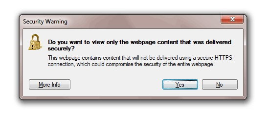
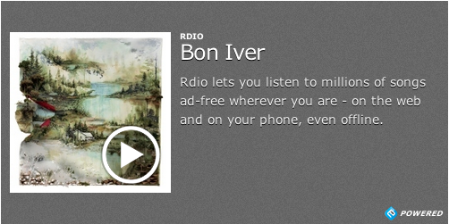

SSL
===

This feature is currently in :ref:`Beta <beta>`.

If your site runs via SSL it can often be hard to obtain the level of richness
you desire. 3rd party assets are very rarely served via HTTPS so you often have
to download all the images yourself and limit the number of providers you
support. Embedly changes this by proxying images over SSL and serving all
embeds within a secure iframe.

Using Embedly with SSL mitigates all of what we like to call the "red X" errors
in web browsers. You know the ones, the mixed content errors that scare users
off your site. It is helpful to understand how Embedly-provided SSL will work
with images, videos, and rich media embeds.

Enabling SSL
------------
Add the query parameter ``secure=true`` to any API call::

  http://api.embed.ly/1/oembed?secure=true&url=http%3A%2F%2Fvimeo.com%2F18150336&key=<key>&maxwidth=500

The response will look like this:

.. code-block:: json

  {
    "provider_url": "http://vimeo.com/",
    "description": "The Need 4 Speed: ....",
    "title": "Wingsuit Basejumping - The Need 4 Speed: The Art of Flight",
    "html": "<iframe src=\"https://media.embed.ly/1/frame?url=http%3A%2F%2Fvimeo.com%2F18150336&width=500&secure=true&key=<key>&height=281\" width=\"500\" height=\"281\" border=\"0\" scrolling=\"no\" frameborder=\"0\"></iframe>",
    "author_name": "Phoenix Fly",
    "height": 281,
    "width": 500,
    "thumbnail_url": "https://i.embed.ly/1/image?url=http%3A%2F%2Fb.vimeocdn.com%2Fts%2F117%2F311%2F117311910_1280.jpg&key=<key>",
    "thumbnail_width": 1280,
    "version": "1.0",
    "provider_name": "Vimeo",
    "type": "video",
    "thumbnail_height": 720,
    "author_url": "http://vimeo.com/phoenixfly"
  }

Images
------
You'll notice in the above ``thumbnail_url`` has changed from::

  http://b.vimeocdn.com/ts/117/311/117311910_1280.jpg

to::

  https://i.embed.ly/1/image?url=http%3A%2F%2Fb.vimeocdn.com%2Fts%2F117%2F311%2F117311910_1280.jpg&key=<key>

Secure utilizes Embedly's :doc:`Image Proxy <image/index>` to serve the image
content over HTTPS. Note that Embedly respects the cache time of the upstream
image, so we will cache it locally for that period of time. This works for all
image fields (thumbnail_url, open_graph.image, etc.) passed back from our
:doc:`API endpoints </endpoints/index>`.

Video and Rich Media Embeds
---------------------------
Secure will also modify all video and rich embed fields (oembed.html,
object.html, etc.) passed back from our :doc:`API endpoints
</endpoints/index>`. Each embed will now be wrapped in an HTTPS iframe::

  <iframe src="https://media.embed.ly/1/frame?url=http%3A%2F%2Fvimeo.com%2F18150336&width=500&secure=true&key=<key>&height=281"
  width="500" height="281" border="0" scrolling="no" frameborder="0"></iframe>

Secure utilizes Embedly's :doc:`XSS Protection <frame>` to accomplish this.
There are a few things to note here when dealing with HTTPS embeds, as the
implementation depends on the provider and the browser.

Secure Providers
^^^^^^^^^^^^^^^^
There are only a few sites that serve embeds over HTTPS, they are as follows:

  * `YouTube <http://youtube.com>`_
  * `Vimeo <http://vimeo.com>`_
  * `SoundCloud <http://soundcloud.com/>`_

For these embeds you will not see any mixed content warnings, and they will
show as embedded media in IE. We are actively working on adding more
secure providers.

Insecure Providers
^^^^^^^^^^^^^^^^^^
Every other `provider <http://embed.ly/providers>`_ falls in this category. In
order to have the best of both worlds, Embedly will still serve the insecure
content within a secure iframe. This will cause the mild security warning that
you see on most HTTPS sites that serve embeds, like Twitter.

.. image:: ../images/twitter_insecure.png
  :class: exampleimg

This works for Chrome, Firefox and Safari. If you wish to avoid these warnings,
use only the providers listed in the secure providers section.

Internet Explorer
^^^^^^^^^^^^^^^^^
IE has the strictest warning when dealing with HTTPS content, if you haven't
seen it it looks like this:

The user must click 'yes' before proceeding to the site. To get around this,
Embedly will switch out the embed with a secure representation. It looks like
this:

When the user clicks that giant play button, they are taken to the embed's URL.
If you would like to see what any one embed looks like in IE mode you can add
``browser=Explorer`` to any media.embed.ly URL like so::

  https://media.embed.ly/1/frame?browser=Explorer
  &url=http%3A%2F%2Fwww.rdio.com%2Fartist%2FBon_Iver%2Falbum%2FBon_Iver%2F
  &width=500&secure=true&key=internal&height=250

Script Tags
^^^^^^^^^^^
Like :doc:`XSS Protection <frame>`, Secure will not embed content that is
generated via script tags. It's impossible to determine the embed dimensions
and ensure that everything is served over HTTPs.

Examples
--------
Here are a few API calls that return the SSL feature::

  http://api.embed.ly/1/oembed?url=www.khanacademy.org%2Fmath%2Farithmetic%2Faddition-subtraction%2Fv%2Fbasic-addition&secure=true&key=<key>
  http://api.embed.ly/1/oembed?url=http%3A%2F%2Fitunes.apple.com%2Fus%2Falbum%2Fdrop-it-like-its-hot-single%2Fid21807343&secure=true&key=<key>

NOTE: You will need to add your key and have SSL enabled to test.
